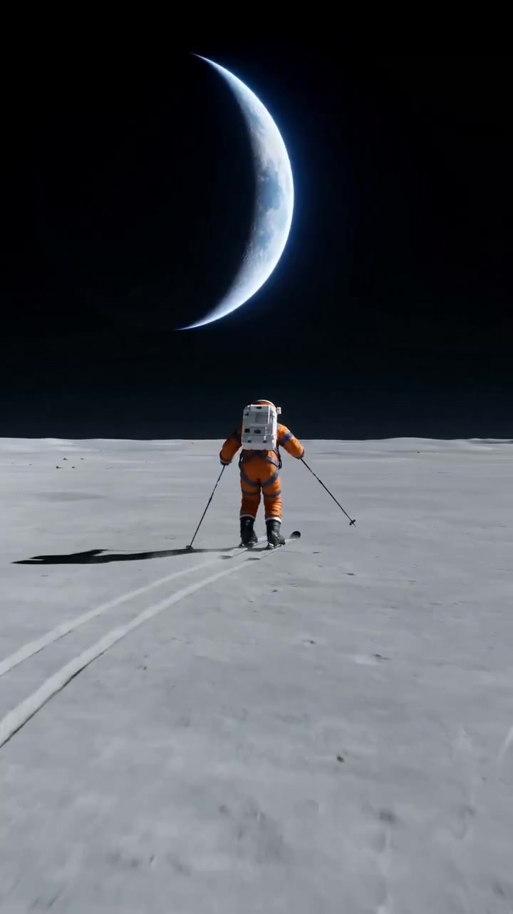
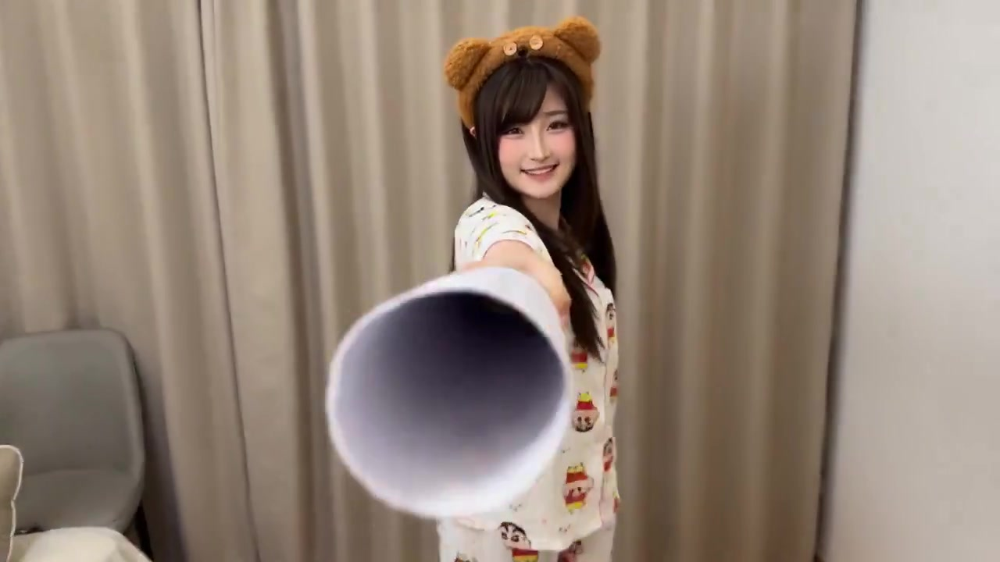
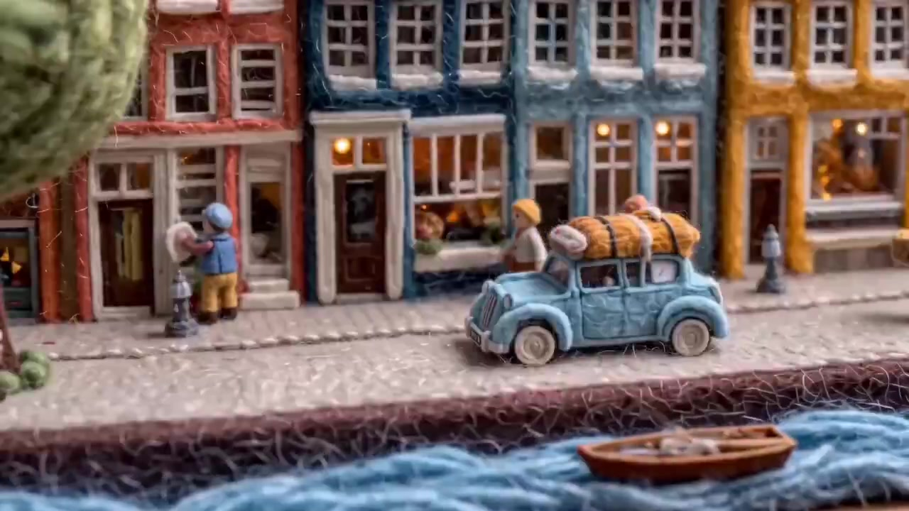
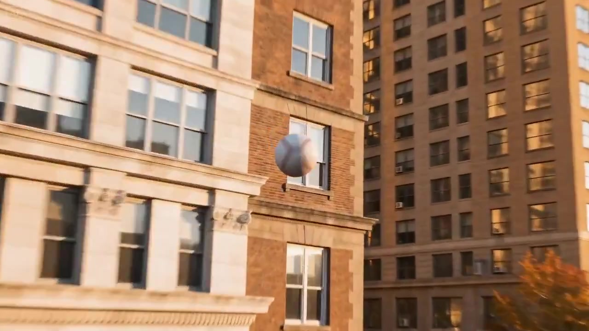
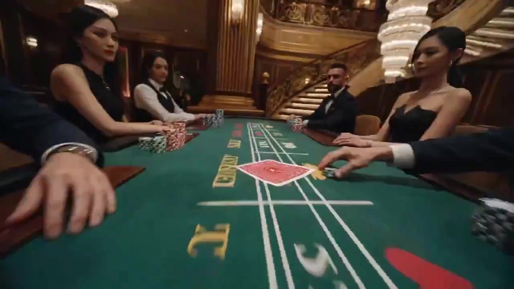

[](README_zh.md) [](README_ja.md) [](README_ko.md) [](README_es.md)

<div align="center">
  

  # 🎬 Seedance 2.0 Prompts

  **A community-curated collection of video generation prompts for [Seedance 2.0](https://seed.bytedance.com/en/seedance2_0) by ByteDance**

  [](https://awesome.re)
  [](https://github.com/Ericgood/seedance-prompt)
  [](https://creativecommons.org/licenses/by/4.0/)
  [](https://github.com/Ericgood/seedance-prompt/pulls)

  **[Browse Gallery](https://seedanceprompt.io)** | **[Submit a Prompt](https://github.com/Ericgood/seedance-prompt/issues/new)**

</div>

---

## 🎬 What is Seedance 2.0?

**Seedance 2.0** is a multimodal video generation model developed by **ByteDance's Seed team**, launched on **February 10, 2026**. It is the industry's first model supporting **simultaneous quad-modal input** — image, video, audio, and text — with native audio-video joint generation.

### Key Highlights

- 🏆 **Elo 1,269 on AI Video Arena** — Surpassed Google Veo 3, OpenAI Sora 2, and Runway Gen-4.5 at launch
- 🎯 **@ Reference System** — Bind up to 9 images, 3 videos, and 3 audio tracks for precise creative control
- 🔊 **Native Audio Sync** — Stereo output with 8+ language lip-sync, dialogue, ambient sound, and Foley in one pass
- 🎬 **Multi-Shot Storytelling** — Build entire cinematic sequences with visual continuity, not just isolated clips
- 📷 **Director-Level Camera** — Dolly zooms, rack focus, tracking shots, POV switches, smooth handheld
- ⏱️ **Up to 15 Seconds** — The longest single-generation duration among major competitors
- 📐 **720p Native** — With 1080p and 2K upscale available

### Architecture

The model uses a **Multi-Modal Diffusion Transformer (MMDiT)** with two specialized branches:

- **DiT (Diffusion Transformer) branch** — handles spatial generation (textures, lighting, detail), replacing the traditional U-Net backbone
- **RayFlow (Rectified Flow Transformer) branch** — handles temporal coherence (motion, physics, transitions)
- **TA-CrossAttn** (Temporal-Audio Cross-Attention) — synchronizes audio and video across differing temporal granularities

Uses a **Flow Matching framework** instead of traditional Gaussian diffusion, achieving ~30% speed improvement over v1.5.

### Technical Specs

| Spec | Detail |
|:---|:---|
| **Architecture** | MMDiT: DiT (spatial) + RayFlow (temporal) + TA-CrossAttn (audio sync) |
| **Developer** | ByteDance (Seed Team) — March 24, 2026 (global rollout) |
| **Resolution** | 720p native · 1080p / 2K upscale available |
| **Duration** | 4–15 seconds per generation |
| **Frame Rate** | 24fps |
| **Aspect Ratios** | 7 supported: 16:9, 9:16, 1:1, 4:3, 3:4, 21:9, adaptive |
| **Input Modalities** | Text + Images (×9) + Videos (×3) + Audio (×3) via @ tags |
| **Audio** | Stereo output · 8+ language phoneme-level lip-sync · Foley & ambient |
| **Generation Modes** | Text-to-Video (T2V) · Image-to-Video (I2V) · Video-to-Video (V2V) |
| **Generation Speed** | ~90–120 seconds for 5–10s clip at 720p |
| **Available On** | CapCut, Dreamina (即梦), Jimeng (China), third-party APIs |

### How It Compares

| Feature | Seedance 2.0 | Kling 3.0 | Sora 2 | Veo 3.1 | Gen-4.5 |
|:---|:---:|:---:|:---:|:---:|:---:|
| **Developer** | ByteDance | Kuaishou | OpenAI | Google | Runway |
| **Arena Elo (T2V)** | **1,269** | 1,248 | ~1,220 | 1,226 | ~1,180 |
| **Max Duration** | **15s** | 10s | 12s | 8s | 10s |
| **Resolution** | 1080p | **4K@60fps** | 1080p | Cinema 4K | 1080p |
| **Image Refs** | **9** | 1–2 | 1 | 1–2 | 1–2 |
| **Video Refs** | **3** | ❌ | ❌ | 1–2 | ✅ |
| **Audio Refs** | **3** | ❌ | ❌ | ❌ | ❌ |
| **Native Audio** | ✅ Stereo | ✅ | ✅ | ✅ | ❌ |
| **Global API** | Third-party | ✅ | Restricted | ✅ | ✅ |

**Head-to-head:**
- **vs Kling 3.0** — Seedance excels in creative control and multi-reference; Kling offers smoother motion, more consistent faces, native 4K
- **vs Sora 2** — Sora prioritizes physics realism; Seedance prioritizes reference control and audio structure
- **vs Veo 3.1** — Seedance wins on duration and multi-modal input; Veo achieves superior photorealism and color grading

*Data from [Artificial Analysis Video Arena](https://artificialanalysis.ai/) and independent reviews, 2026.*

### What Reviewers Say

> *"The best model yet"* for dynamic motion and physics — **CuriousRefuge**

> *"One of its clearest advantages"* is the @ reference system — **Evolink AI**

> *"A real strength in practical testing"* — audio synchronization — **WaveSpeed AI**

**Strengths:** Best-in-class reference system, strong audio sync, excellent multi-shot narratives, cinematic camera control, superior physics simulation.

**Limitations:** 720p native resolution (2K upscale available), steep learning curve (operator-sensitive), strict content moderation on realistic faces, generation speed slower than some alternatives.

> *Review sources: [CuriousRefuge](https://curiousrefuge.com/blog/seedance-2-review) · [Evolink AI](https://evolink.ai/blog/seedance-2-review-best-ai-video-generator-2026) · [WaveSpeed AI](https://wavespeed.ai/blog/posts/seedance-2-0-review-issues-and-alternatives/)*

---

## 📊 Stats

| Total Prompts | Featured | Videos | Last Updated |
|:---:|:---:|:---:|:---:|
| **111** | **11** | **10** | April 2026 |

---

## 🏆 Featured Demos

Hand-picked prompts showcasing Seedance 2.0's best capabilities.

---

### 1. 🌙 Astronaut Skiing on the Moon


> 8K photorealistic — 1/6th gravity physics, dust haze, crescent Earth on the lunar horizon.

#### 📝 Prompt

```
Wide shot. A lone astronaut in a dusty orange pressure suit with dark blue-gray harness
straps and black boots skis across a vast lunar plain, leaving two long parallel tracks
in the gray regolith behind. The astronaut is mid-stride, poles planted, pushing forward
in 1/6th gravity, each push sending the body drifting slightly upward before settling back.
Fine dust hangs in a low haze along the ski tracks. Behind and above, a crescent Earth sits
just over the soft curve of the lunar horizon, blue-white atmospheric glow against total
black sky. Raw sunlight, crushed shadows, no fill. 8K photorealistic. No logos on the suit.
```

<div align="center">
  <a href="videos/astronaut-moon-ski.mp4">
    
  </a>
  <br>
  <a href="videos/astronaut-moon-ski.mp4">📥 Download Video</a> ・ <a href="https://x.com/i/status/2041855477617713535">🐦 Source</a>
</div>

---

### 2. 🧛 Vampire Princess Transformation


> Full-reference masterclass — 5 distinct shots from cozy daily life to gothic vampire with blood moon, showcasing multi-shot narrative and VFX transitions.

#### 📝 Prompt

```
Shot One: Everyday Home Scene (0:00-0:02) Medium shot handheld follow-cam. Girl in
Crayon Shin-chan pajamas with bear hairband waves a paper telescope, then presses it
against the lens — physical darkness creates transition.
Shot Two: Spacetime Tunnel (0:02-0:04) First-person rapid push-in through the paper
tube. Deep red vortex and wormhole CG effects, bats fly out as guides.
Shot Three: Vampire Princess Descends (0:04-0:06) Overhead to medium shot. Transformed
princess (white hair, elven ears, ornate gown, red nails) extends hand toward lens.
Slow-motion red petals, Gothic branches background.
Shot Four: Alluring Freeze-Frame (0:06-0:09) Glitch effects, frame-skipping, radial
blur, high-saturation red background. Cyberpunk vibes.
Shot Five: Blood Moon Flight (0:09-0:12) Long shot. Massive demonic wings, blood moon,
dark red clouds, bats in slow-motion flight.
```

<div align="center">
  <a href="videos/vampire-transformation.mp4">
    
  </a>
  <br>
  <a href="videos/vampire-transformation.mp4">📥 Download Video</a> ・ <a href="https://x.com/i/status/2042124667910008998">🐦 Source</a>
</div>

---

### 3. ☀️ Morning City Ambience


> Multi-cut slice of life — mailman, baker, barista, accordion player, flower seller, street painter. Warm European morning vibes.

#### 📝 Prompt

```
Morning city ambience, people walking, cars driving, bikes riding.
[cut] The mailman on the bike drops a newspaper into the mailbox.
[cut] The baker places the buns on the counter.
[cut] The man playing the accordion on the street.
[cut] The woman pushing the baby stroller.
[cut] The barista making coffee.
[cut] The man playing the flute to his dog.
[cut] The man selling tulips on the street.
[cut] The man painting on the street.
```

<div align="center">
  <a href="videos/morning-city-ambience.mp4">
    
  </a>
  <br>
  <a href="videos/morning-city-ambience.mp4">📥 Download Video</a> ・ <a href="https://x.com/i/status/2038619621419569552">🐦 Source</a>
</div>

---

### 4. 🦛 Kit Kat Hippo — Continuous Tracking Shot


> Single continuous ball-follow shot — from golden hour street through a window into an opulent room, revealing a hippo in a bathrobe eating chocolate. Deadpan surreal advertising masterpiece.

#### 📝 Prompt

```
Over the shoulder of a young man in a beanie and jacket on a wet urban street at golden
hour. He winds up and hurls a baseball toward the building across the street. The camera
stays attached to the ball as it spins forward crossing the street, rises toward the facade,
passes through a window with glass parting gently around it catching golden light. The ball
continues through the interior of an opulent wood-paneled room, glides over a herringbone
parquet floor scattered with red chocolate wrappers and foil. The ball slows, rolls past
the foot of a velvet sofa and settles on the floor. The camera drifts upward from ball
level revealing a massive hippo in a white bathrobe reclining on the sofa surrounded by
red chocolate bars. He glances down at the ball with lazy curiosity, looks away and keeps
chewing. Hold. Hyper-realistic cinematic single continuous shot, warm golden hour exterior
transitioning seamlessly to rich amber interior. Anamorphic look. Deadpan surreal payoff.
```

<div align="center">
  <a href="videos/kitkat-hippo-ad.mp4">
    
  </a>
  <br>
  <a href="videos/kitkat-hippo-ad.mp4">📥 Download Video</a> ・ <a href="https://x.com/i/status/2041236549317378556">🐦 Source</a>
</div>

---

### 5. 🃏 Casino Poker Card Flight — 15s POV


> 15-second card-POV cinematic: from sexy dealer through spiral staircase, diving halls, to hidden hand delivery. Showcasing complex camera tracking and multi-shot narrative.

#### 📝 Prompt

```
15秒赌场扑克牌飞行视频，黑桃K从性感女荷官手中飞出，以紧跟牌的视角穿越整个豪华赌场。
镜头1：女荷官上半身特写，手持黑桃K，牌正面朝向镜头。
镜头2：牌弹出瞬间，紧跟牌背面视角快速掠过赌桌区。
镜头3：牌沿螺旋楼梯弧线轨迹上升。
镜头4：牌高速直线穿越走廊。
镜头5：牌从二楼俯冲进入大堂。
镜头6：牌减速从玩家后方下面接近。
镜头7：牌悄悄传递到手中，翻转展示黑桃K正面。
镜头8：切回女荷官自信微笑特写。
写实风格、电影级质感、高速摄影、运动模糊、戏剧性打光。
```

<div align="center">
  <a href="videos/casino-card-flight.mp4">
    
  </a>
  <br>
  <a href="videos/casino-card-flight.mp4">📥 Download Video</a> ・ <a href="https://x.com/i/status/2040738604188623155">🐦 Source</a>
</div>

---

## 🤝 How to Contribute

We welcome prompt contributions from everyone!

### Submit via Pull Request

1. **Fork** this repository
2. **Add your video** to `videos/` and thumbnail to `assets/thumbnails/`
3. **Update** `prompts.json` with your prompt entry
4. **Submit a PR** — we'll review and merge it!

### Submit via Issue

Don't want to deal with PRs? Just [open an issue](https://github.com/Ericgood/seedance-prompt/issues/new) with:

- Your prompt text
- Video file or link
- Description of what it generates
- Your name/handle for credit

### Prompt Data Format

Each entry in `prompts.json`:

```json
{
  "id": "your-prompt-id",
  "title": "Your Prompt Title",
  "title_zh": "你的提示词标题",
  "prompt": "Your full prompt text...",
  "description": "Brief description of the output",
  "description_zh": "输出的简要描述",
  "category": "Cinematic",
  "tag": "Cinematic",
  "tag_zh": "电影级",
  "tagColor": "#FF4D00",
  "model": "Seedance 2.0",
  "author": "Your Name",
  "source": "https://x.com/...",
  "video": "videos/your-video.mp4",
  "thumbnail": "assets/thumbnails/your-video.jpg",
  "featured": false,
  "date": "April 2026"
}
```

### Guidelines

- ✅ Original prompts you created or have permission to share
- ✅ Include the model used (Seedance 2.0)
- ✅ Add a description of the expected output
- ✅ Video/thumbnail previews are highly encouraged
- ❌ No NSFW content
- ❌ No copyrighted character reproductions

---

## 📜 License

This project is licensed under [CC BY 4.0](https://creativecommons.org/licenses/by/4.0/). You are free to share and adapt the prompts, as long as you give appropriate credit.

## 🌐 Links

- 🎬 [Seedance 2.0 Official](https://seed.bytedance.com/en/seedance2_0) — ByteDance Seed Team
- 🌐 [seedanceprompt.io](https://seedanceprompt.io) — Browse prompts in a visual gallery
- 📊 [Artificial Analysis Video Arena](https://artificialanalysis.ai/) — Model rankings
- 📝 [CuriousRefuge Review](https://curiousrefuge.com/blog/seedance-2-review) — "The best model yet"
- 📝 [Evolink AI Review](https://evolink.ai/blog/seedance-2-review-best-ai-video-generator-2026) — Comprehensive feature analysis
- 📝 [WaveSpeed AI Review](https://wavespeed.ai/blog/posts/seedance-2-0-review-issues-and-alternatives/) — Issues and alternatives
- 💬 [Discussions](https://github.com/Ericgood/seedance-prompt/discussions)
- 🐛 [Report Issues](https://github.com/Ericgood/seedance-prompt/issues)

## 🙏 Acknowledgements

- Prompt data sourced from [awesome-seedance-2-prompts](https://github.com/YouMind-OpenLab/awesome-seedance-2-prompts) (CC BY 4.0)
- All original prompt authors are credited in each entry
- ByteDance Seed Team for building Seedance 2.0

---

<div align="center">

**If you find this useful, give us a ⭐!**

Made with ❤️ by the Seedance Prompt Community

</div>
